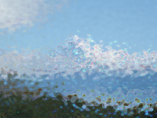

Distorts the image as though it were seen through frosted glass.

   - `Color` — The color to tint the image.
   - `Brightness` — How bright to make the image.  When Brightness is 1 and Color is white, the image's colors are passed through as-is, without tinting or change in brightness.  You'll often want to make this greater than 1, to compensate for the loss in brightness when tinting with a non-white color.
   - `Noise Time` — The time at which to evaluate the image.  To animate the noise, connect a continuously increasing number, such as the output of the `Render Image to Window` node's `Requested Frame` port.
   - `Noise Amount` — How much the light gets bent.
   - `Noise Scale` — The size of the noise pattern.  At smaller values, the noise ripples are more closely packed together.
   - `Chromatic Aberration` — How much the red/green/blue color channels separate when the light is bent.  At 0, all colors are treated the same.  At larger values, red and blue are bent differently than green, simulating the prismatic effect of a typical lens.
   - `Levels` (Octaves) — How many layers of noise to blend together when displacing the image.
   - `Roughness` (Persistence) — How much each level contributes to the total displacement.  At 1, all noise levels are equal.  At 0.5, the second level is half the intensity of the first level, the third level is one quarter the intensity of the first, and so on.
   - `Spacing` (Lacunarity) — How much smaller each level is.  At 2, the second level is half the size of the first, the third level is one quarter the size of the first, and so on.
   - `Iterations` — How many different displacement patterns are averaged together.  A value of 1 uses just a single noise pattern, and can look like a warped piece of plastic.  Higher values produce images that look more like frosted glass, but can take longer to render.

