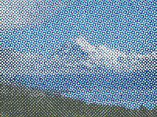

Makes the image look like it was printed, by passing it through cyan, magenta, yellow, and black halftone screens.

   - `Center` — The position from which the pattern appears to grow.  At (0,0), the pattern appears to grow from the center; at (-1,0), the pattern appears to grow from the left edge.
   - `Scale` — The size of the pattern.  At smaller values, the dots are more closely packed together.
   - `Cyan`, `Magenta`, `Yellow`, `Black Amount` — How much each color is present in the output image.
   - `Undercolor Removal` — How much of the input image's black to remove from each of the cyan, magenta, and yellow halftone screens.
   - `Splotchiness` — How irregular each dot is.  At 0, the dots are circular.  At 5, the dots are highly irregular.
   - `Color Offset` — The amount, in Vuo Coordinates, that the halftone screens are moved from their ideal positions.
   - `Color Offset Angle` — The rotation of the halftone screen offset.  This only has an effect if `Color Offset` is nonzero.

Thanks to [Stefan Gustavson](http://webstaff.itn.liu.se/~stegu76/) for the shader this node was based on.

