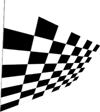
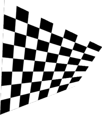

Stretches an image by specifying the positions of its four corners.  Useful for projection mapping.

- `Image` – The image to stretch.
- `Projection` – How the image is mapped to the quadrilateral:
   - Perspective projection is useful for when you want to project onto a rectangular surface that isn't directly facing the camera (e.g., 3 sides of a cardboard box).
   - Affine projection is useful for when you want to project onto a nonrectangular (e.g., parallelogram, trapezoid) surface that is directly facing the camera.
- `Gamma` – The darkness or brightness of colors, especially affecting the medium-brightness colors (midtones). At 1, the image is unchanged. At 0, the image is white. As gamma increases, the image becomes darker.
- `Top Left`, `Top Right`, `Bottom Left`, `Bottom Right` – The positions of the four corners of the image, in Vuo Coordinates.
- `Left Edge`, `Right Edge`, `Top Edge`, `Bottom Edge` – The cropping and blending from each edge toward the center of the image.
   - "Crop" is the proportion of the image that should be cropped out. When cropped, the image is stretched so that it still reaches the corner points.
   - "Cutoff" is the proportion of the image that should be blended from transparent to the image's full opacity.
   - "Gamma" controls the gradient of the blending. As gamma increases, the change from transparent to full opacity becomes more gradual.

**Perspective**

**Affine**

