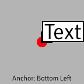

Nodes for working with 2D objects called layers that can be stacked to create composite images.

A **layer** is a rectangle that contains one or more images, texts, or shapes. For example, each of the `Make Image Layer` nodes inputs an image and outputs a layer whose rectangle is filled with that image. The [Make Oval Layer](vuo-node://vuo.layer.make.oval2) node outputs a layer whose rectangle has a transparent background and contains an oval that extends to the edges of the rectangle.

Layers can be combined as if they were stacked on top of one another to create a **composite image**. For example, the [Render Layers to Window](vuo-node://vuo.layer.render.window2) node inputs a list of layers, ordered from background to foreground, and composites them to create the single image displayed in the window.

If you want several layers to move together, you can **group** them with the `Combine Layers` nodes. Each of these nodes inputs a list of layers and outputs a "parent" layer that contains all of the input "child" layers. Instead of moving the child layers individually, you can move the parent layer, and all of the child layers move with it.

### Placement

Most nodes that create a layer determine the layer's placement with an **anchor** and a **position**. The position is a point in the composite image. The anchor is the part of the layer that should be located at that point. For example, if the anchor is the bottom left corner of the layer, the layer will be placed so that its bottom left corner is at the given position. If the anchor is the center of the layer, the layer will be centered at the given position.

The diagram below shows the placement of a layer created by [Make Text Layer](vuo-node://vuo.layer.make.text2), with a red dot showing the position.

### Size and scaling

Most of the nodes that create layers input a size, which determines how big the layer is relative to the composite image. For example:

   - The [Make Rectangle Layer](vuo-node://vuo.layer.make.rect) node has Width and Height input ports.
   - The [Make Image Layer (Scaled)](vuo-node://vuo.layer.make.scaled) node has a Width input port. The layer's height is determined by the aspect ratio of the input image.
   - The [Make Text Layer](vuo-node://vuo.layer.make.text2) node has a Font input port. The layer's width and height are calculated based on the font size and the size of the window or image in which the layer is being rendered.

The layers outputted by these nodes are called **scaled layers** because their size scales with the size of the composite image.

A few nodes, including [Make Image Layer (Real Size)](vuo-node://vuo.layer.make.realSize2), create a different kind of layer. **Real Size layers** are always rendered at the same size no matter how large or small the composite image. The purpose is to keep the image sharp, rather than allowing it to become blurred by resizing. A Real Size layer can be translated but can't be rotated or scaled.

### Real Size layers and Retina screens

Each image has a **Scale Factor** (see the Image node set documentation for more information).  The Scale Factor is used when rendering a Real Size layer with the `Preserve Physical Size` port set to true.

For example, when `Preserve Physical Size` is false:

&nbsp;                         | Non-Retina (1x) screen                         | Retina (2x) screen
------------------------------ | ---------------------------------------------- | ----------------------------------------------
**Image with Scale Factor 1x** | Each image pixel is rendered as 1 screen pixel | Each image pixel is rendered as 1 screen pixel
**Image with Scale Factor 2x** | Each image pixel is rendered as 1 screen pixel | Each image pixel is rendered as 1 screen pixel

And when `Preserve Physical Size` is true:

&nbsp;                         | Non-Retina (1x) screen                                           | Retina (2x) screen
------------------------------ | ---------------------------------------------------------------- | -----------------------------------------------------
**Image with Scale Factor 1x** | Each image pixel is rendered as 1 screen pixel                   | Each image pixel is rendered as 4 screen pixels (2x2)
**Image with Scale Factor 2x** | Each group of 4 image pixels (2x2) is rendered as 1 screen pixel | Each image pixel is rendered as 1 screen pixel

### Coordinates

In **Vuo Coordinates**, (0,0) is the center of the composite image. The composite image has a width of 2, with X-coordinate -1 on the left edge and 1 on the right edge. The composite image's height is determined by its aspect ratio, with the Y-coordinate increasing from bottom to top. 

